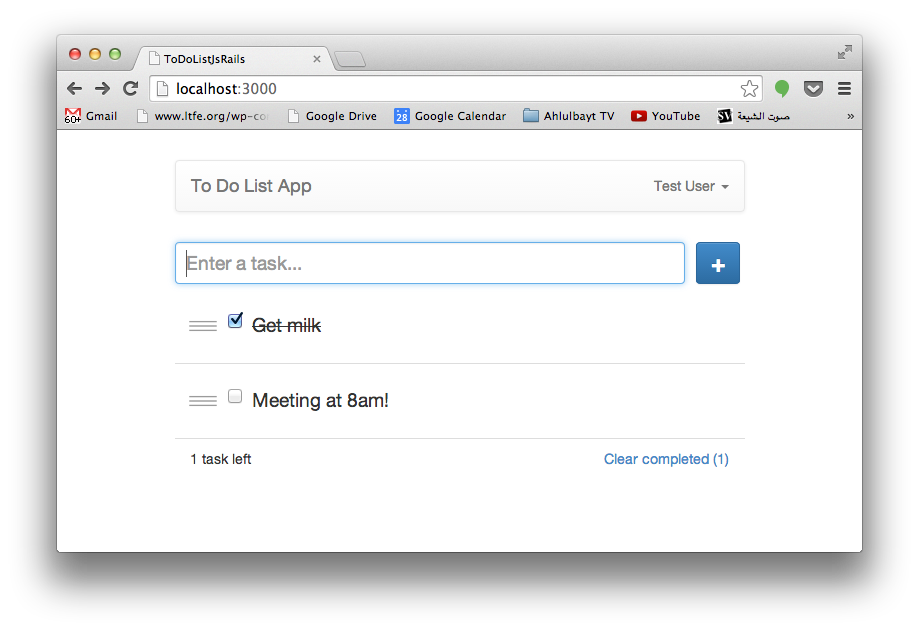

To-do List (Rails + JavaScript)
================================

A(nother) To Do List app written in JavaScript (Front-end) and Rails (Back-end) for practice.

## Demo
http://todo-muhanad.herokuapp.com

## Instructions
	git clone git@github.com:muhanad40/To-Do-List-JS-Rails.git
	cd To-Do-List-JS-Rails
	bin/rake db:create
	bin/rake db:migrate
	bin/rails s
Then visit **http://localhost:3000**

If you want to run the RSpec tests, run:

	bin/rake db:create RAILS_ENV=test
	bin/rake db:migrate RAILS_ENV=test
	rspec

## Why a todo app?
I was inspired by the [ToDoMVC](http://todomvc.com/architecture-examples/angularjs/) project. So I decided to do the same kind of app using JavaScript and Rails. A todo app is a CRUD application. That allowed me to interact with the Rails API in different situations; create, read, update and delete. I also learnt a lot about JavaScript and how much MVC frameworks are important. Doing things in pure JavaScript is ok up to a certain point. Once your project becomes large it will become increasingly difficult to keep everything together organised and funtioning well. I kept running into problems when I moved into Rails. Problems such as order of execution of functions. Data that was edited needed to be refreshed so the client side (JavaScript) can manipulate and read the latest copy. Some functions relied on the latest copy of the data and were getting called before the fetching of the new data arrives to the client side. This is when I had to use a callback function.

## Rails? Overkill?
I know it's too much for a todo app to use Rails. I wanted to learn how to interact with the Rails API in a simple CRUD application.

## Improvements?
Use IDs as keys and task item data as value. that way I can delete items from the local copy easily without having to use the 'splice' method

## JavaScript (only) version
https://github.com/muhanad40/To-Do-List-JS

## Technologies
* RSpec
* Rails 4.1
* jQuery
* PostgreSQL
* Capybara
* Poltergeist (boo!)
* Twitter Bootstrap
* Heroku