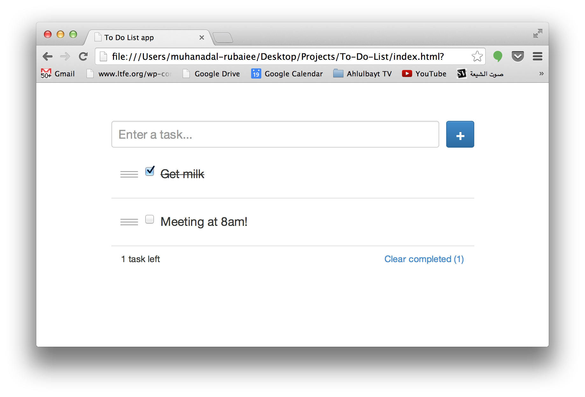

To-Do-List
==========

A(nother) non-MVC To Do List app written in JavaScript for practice

I wanted to replicate the same functionalities as the ToDoMVC app (http://todomvc.com/architecture-examples/angularjs/)

This a non-MVC approach to making a JavaScript app, which is not the proper way. I only wanted to code a small app the hard way to learn about JavaScript. The next step is to get into BackboneJS/AngularJS frameworks.